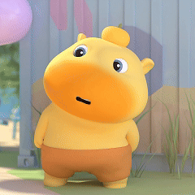
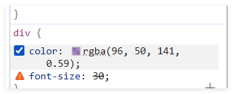

# CSS定义
**层叠样式表**(Cascading Style Sheets),是一种样式表语言，用来描述HTML文档的呈现（美化内容）
书写位置：`title`标签下方添加`style`双标签，`style`标签里面书写CSS代码
```html
<!DOCTYPE html>
<html lang="en">
<head>
    <meta charset="UTF-8">
    <meta name="viewport" content="width=device-width, initial-scale=1.0">
    <title>初识CSS</title>
    <style>
        /* CSS代码 */
        /* 选择器 { CSS属性 } */
    </style>
</head>
<body>
    <p>体验CSS</p>
</body>
</html>
```
```html
<style>
    /* CSS代码 */
    /* 选择器 {CSS属性} */
    /* 属性名与属性值成对出现 --> 键值对 */
    p {
        /* 文字颜色 */
        color: brown;
        /* 字号 */
        font-size: 30px;
    }
</style>
```
# CSS引入方式
- 内部样式表：学习使用
  - CSS代码写在`style`标签里面
- 外部样式表：开发使用
  - CSS代码写在单独的CSS文件中(.css)
  - 在HTML使用`link`标签引入 : `<link rel="stylesheet" href="">`
  `rel`:关系，此处为样式表

$mycss.css$
```css
/* 这个文件放CSS代码 */
/* 选择器 {CSS属性} */
p {
    color: red;
}
```
```html
<title>初识CSS</title>
    <!-- 引入外部样式表 -->
    <link rel="stylesheet" href="mycss.css">
```
- 行内样式：配合JavaScript使用
  - CSS写在标签的`style`属性值里
```html
<body>
    <p>这是p标签</p>
    <!-- 行内, style="" -->
    <div style="color: red; font-size: 30px;">这是div标签</div>
</body>
```
# 选择器
作用：查找标签，设置样式
## 基础选择器
- 标签选择器
- 类选择器
- id选择器
- 通配符选择器
## 标签选择器
标签选择器：使用标签名作为选择器-->选中所有同名标签设置相同的样式（无法差异化同名标签的样式）
>例如:p{},h1{},div{},a{},img{}
```html
<style>
    /* 定义 */
    p {
        color: red;
    }
</style>
<!-- 所有p标签内的字都变红 -->
```
## 类选择器
作用：查找标签，差异化设置标签的显示效果
步骤:
- 定义类选择器 --> `.类名`
- 使用类选择器 --> 标签添加`class='类名`
注意：
- 类名自定义，不要用纯数字或中文，尽量用英文命名
- 一个类选择器可以供多个标签使用
- 一个标签可以使用多个类名，类名之间用空格隔开

**开发习惯：类名见名知义，多个单词可以用`-`连接，例如：`news-hd`(新闻头部)**
```html
    <title>初识CSS</title>
    <style>
        /* 定义 */
        .red {
            color: red;
        }
    </style>
</head>
<body>
    <!-- 使用 -->
    <p class="red">这是p标签</p>
    <p>感谢朱哥</p>
    <div class="red">这是div标签</div>
</body>
```
```html
<style>
        /* 定义 */
        .red {
            color: red;
        }
        .size {
            font-size: 50px;
        }
    </style>
</head>
<body>
    <!-- 使用 -->
    <p class="red size">这是p标签</p>
    <p>感谢朱哥</p>
    <div class="red size">这是div标签</div>
</body>
```
**一个类可以为多个标签使用，一个标签可以使用多个类，注意使用多个类时的书写方法（类名用空格隔开）**
## id选择器
作用：查找标签，差异化设置标签的显示效果
场景：id选择器一般配合JavaScript使用，很少用来设置CSS样式
步骤：
- 定义id选择器 --> `#id名` 
- 使用id选择器 --> 标签添加`id="id名"`

*规则：同一个id选择器在一个页面只能使用一次*
```html
<style>
        /* 定义 */
        #brown {
            color: brown;
        }
    </style>
</head>
<body>
    <!-- 使用 -->
    <p>这是p标签</p>
    <p id="brown">感谢朱哥</p>
    <div >这是div标签</div>
</body>
```
# 通配符选择器
作用：查找页面所有标签，设置相同样式
通配符选择器:`*`,不需要调用，浏览器自动查找页面**所有**标签，设置相同的样式
```html
    <style>
        /* 定义 */
        * {
            color: blue;
        }
    </style>
</head>
<body>
    <!-- 使用 -->
    <p>这是p标签</p>
    <p>感谢朱哥</p>
    <div >这是div标签</div>
</body>
```
# 画盒子
目标：使用合适的选择器画盒子
新属性：
- `width`:宽度
- `height`:高度
- `background-color`:背景色
```html
<style>
        .red {
            width: 100px;
            height: 100px;
            background-color: brown;
        }
        .orange {
            width: 200px;
            height: 200px;
            background-color: orange;
        }
    </style>
</head>
<body>
    <div class="red">div1</div>
    <div class="orange">div2</div>
</body>
```
# 文字控制属性
常见属性:
- `font-size`:字体大小
  - 属性值:文字尺寸，PC端网页最常用的单位`px`(单位不能少)
```html
<style>
    p {
        font-size: 30px;
    }
</style>
```
- `font-weight`:字体粗细
  - 属性值：
    - 数字（更简单，开发使用）
      - 正常:`400`(无单位)
      - 加粗:`700`
    - 关键字
      - 正常:`normal`
      - 加粗:`bold`
```html
    <style>
        h3 {
            font-weight: 400;
        }
        div {
            font-weight: 700;
        }
    </style>
</head>
<body>
    <!-- 标题文字默认加粗 -->
    <h3>h3 标题</h3>
    <div>div 标签</div>
</body>
```
- `font-style`:字体倾斜
  - 作用：清除文字默认的倾斜效果
  - 属性值：
    - 正常（不倾斜）：`normal`
    - 倾斜:`italic`
```html
    <style>
        em {
            font-style: normal;
        }
        div {
            font-style: italic;
        }
    </style>
</head>
<body>
    <em>em 标签</em>
    <div>div 标签</div>
</body>
```
- `line-height`:行高（文字高度（默认`16px`）+上间距+下间距）
  - 测量方法：从一行文字的最顶端（最底端）量到下一行文字的最顶端（最底端）
  - 作用：设置多行文本的间距
  - 属性值：
    - `数字+px`
    - `数字`（当前标签`font-size`字号属性值的倍数）
    - 垂直居中技巧（只适用于单行文字）：行高属性值等于盒子高度属性值（文字本身是对齐的，让盒子适应文字）
```html
    <style>
        p {
            line-height: 30px;
        }
    </style>
</head>
<body>
    <p>中央气象台7月18日18时继续发布暴雨蓝色预警预计7月18日20时至19日20时云南西部和中南部、广西北部贵州南部和东部、重庆东南部湖南大部、湖北南部和东部江西中北部、安徽中南部江苏中南部、上海、浙江北部等地的部分地区有大到暴雨局地有大暴雨上述部分地区伴有短时强降水局地有雷暴大风等强对流天气</p>
</body>
```
```html
    <style>
        div {
            height: 100px;
            background-color: skyblue;
            line-height: 100px;
        }
    </style>
</head>
<body>
    <div>垂直居中</div>
</body>
```
- `font-family`:字体族
  - 属性名：字体名--`font-family: 楷体;`
  - `font-family:Microsoft YaHei, Heiti SC, tahoma, sans-serif`
  - ↑：`font-family`属性值可以书写多个字体名，各个字体名用逗号隔开，执行顺序是从左向右依次查找，直至找到可用的
- `font`:字体复合属性
  - 使用场景：设置网页文字公共样式
  - 复合属性：属性的简写方式，一个属性对应多个值的写法，各个属性值之间用空格隔开
  - `font:是否倾斜 是否加粗 字号/行高 字体` (必须按顺序书写，至少写上字号与字体，平时使用可以从一些大网站上复制过来就行)
```html
<style>
    div {
        font: italic 700 30px/2 楷体;
    }
</style>
```
- `text-indent`:文本缩进
  - 属性值：
    - `数字+px`
    - `数字+em`(推荐，常见，1em=当前标签的字号大小)

首行缩进两个字：
```css
p {
        text-indent: 2em;
    }
```
```html
<style>
        p {
            text-indent: 2em;
            font-size: 30px;
        }
        
    </style>
</head>
<body>
    <p>4月30日，我市召开2026年高质量发展推进会暨“强镇”发展大会。会议强调，牢牢把握高质量发展这个首要任务，完整准确全面贯彻新发展理念，牢固树立和践行正确政绩观，探索走出有特色重效益可持续的高质量发展兴化路径。</p>
</body>
```
- `text-align`:文本对齐
  - 属性值：
    - `left`:左对齐（默认）
    - `center`:居中对齐
    - `right`:右对齐
  - 对齐的是文字内容，标签所占区域没变
```html
    <style>
        h1 {
            text-align: center;
        }
        
    </style>
</head>
<body>
    <h1>测试对齐</h1>
</body>
```
*图片对齐：↓*
```html
    <style>
        div {
            text-align: center;
        }
    </style>
</head>
<body>
    <div> </div>
</body>
```
- `text-decoration`:修饰线
  - 属性值：
    - `none`:无
    - `underline`:下划线
    - `line-through`:删除线
    - `overline`:上划线
```html
    <style>
        a {
            text-decoration: none;
        }
        div {
            text-decoration: underline;
        }
        p {
            text-decoration: line-through;
        }
        span {
            text-decoration: overline;
        }
    </style>
</head>
<body>
    <a href="#">a 标签，去掉下划线</a>
    <div>div 标签，添加下划线</div>
    <p>p 标签，添加删除线</p>
    <span>span 标签，添加顶划线</span>
</body>
```
- `color`:颜色
  - 属性值：
    - 颜色关键词:颜色英文单词:`red`、`green`...-->学习测试
    - rgb表示法:`rgb`(r,g,b):r,g,b表示红绿蓝三原色，取值：0~255-->了解
    - rgba表示法：`rbga(r,g,b,a)`:a表示透明度，取值0~1(越靠近0越透明)-->开发使用，实现透明色
    - 十六进制表示法:`#RRGGBB`:`#000000`,`#ffcc00`,简写:`#000`,`#fc0` -->开发使用（从设计稿复制）
```html
    <style>
        h1 {
            color: rgb(123, 223, 99);
        }
        div {
            color: rgba(96, 50, 141, 0.59);
        }
        span {
            color: #c06161;
        }
        /* span {
            color: #c77;
        } */
    </style>
</head>
<body>
    <h1>h1 标签</h1>
    <div>div 标签</div>
    <span>span 标签</span>
</body>
```
**实际书写时，vscode提供直接的取色盘**
# 调试工具
作用：检查、调试代码；帮助程序员发现代码问题、解决问题
1. 打开调试工具(右键-检查 / F12)
2. 使用调试工具
![!\[alt text\] )](调试1.png)

复选框代表正在生效，可以取消勾选
刷新后均会重置
# 综合案例
网页制作思路：
- 从上到下，先整体再局部
- 先标签，再CSS美化
# 复合选择器
定义：由两个或多个基础选择器，通过不同的方式组合而成
作用：更准确、更高效的选择目标元素（标签）
## 后代选择器
选中某元素的 **所有** 后代元素
选择器写法：`父选择器 子选择器{CSS属性}`,父子选择器之间用空格隔开
```html
    <style>
        div span{
            color: aquamarine;
        }

    </style>
</head>
<body>
    <span>span标签</span>
    <div>
        <span>div子</span>
        <p>
            <span>div孙</span>
        </p>
    </div>
</body>
```
## 子代选择器
选中某元素的子代元素（最近的子级）
选择器写法：`父选择器>子选择器{CSS属性}`,父子选择器之间用`>`隔开
```html
    <style>
        div>span{
            color: aquamarine;
        }

    </style>
</head>
<body>
    <span>span标签</span>
    <div>
        <span>div子</span>
        <p>
            <span>div孙</span>
        </p>
    </div>
</body>
```
## 并集选择器
选中多组标签设置相同的样式
选择器写法：`选择器1,选择器2,...,选择器n{CSS属性}`,选择器之间用`,`隔开
*建议逗号后换行，结构更清晰*
```html
    <style>
        div,
        span,
        p {
            color: red;
        }
    </style>
</head>
<body>
    <div>这是div标签</div>
    <p>这是p标签</p>
    <span>这是span标签</span>
</body>
```
## 交集选择器-了解
选中同时满足多个条件的元素
选择器写法：`选择器1选择器2{CSS属性}`,选择器之间连写，没有任何符号
**注意：如果交集选择器中有标签选择器，标签选择器必须书写在最前面**
```html
    <style>
        p.box{
            color: red;
        }
    </style>
</head>
<body>
     <p class="box">p标签,使用了类选择器</p>
    <p>普通p标签</p>
    <div class="box">div标签,使用了类选择器</div>
</body>
<!-- 交集：满足是p且用了box类选择器 -->
```
# 伪类选择器
伪类表示元素状态，选中元素的某个状态设置样式
- 鼠标悬停状态：`选择器:hover{CSS属性}`(任何标签均可使用)
```html
    <style>
        a {
            color: aqua;
            text-decoration: none;
        }
        a:hover {
            color: blanchedalmond;
            text-decoration: underline;
        }
        .box:hover{
            color: rgb(44, 106, 160);
        }
    </style>
</head>
<body>
    <a href="#">a标签</a>
    <div class="box">div标签</div>
</body>
```
## 伪类-超链接（拓展）
超链接一共有四个状态：
- `:link`:访问前
- `:visited`:访问后
- `:hover`:鼠标悬停
- `:active`点击时(激活)
**提示：如果要给超链接设置以上四个状态，需要按LVHA的顺序书写**
```html
    <style>
        a:link{
            color: rgb(183, 123, 40);
        }
        a:visited{
            color: green;
        }
        a:hover{
            color: rgb(48, 162, 105);
        }
        a:active{
            color: rgb(162, 85, 127);
        }
    </style>
</head>
<body>
    <a href="#">a 标签</a>
</body>
<!-- 有一点需要注意：一个链接点击后默认已点击，则不可回到初始状态了 -->
```
**工作中，一个a标签选择器设置超链接的样式:hover状态设置（其他一般不设置）**
# CSS特性
CSS特性：化简代码/定位问题/并解决问题
## 继承性
子级默认继承父级的**文字控制属性**
```html
    <style>
        body{
            font-size: 30px;
            color: #09cfab;
            font-weight: 700;
        }
    </style>
</head>
<body>
    <!-- 当标签自己有样式（默认或设置）时，生效自己的样式 -->
    <div>div标签</div>
    <p>p标签</p>
    <span>span标签</span>
    <a href="#">a标签</a> <!--颜色没有继承，其他继承了-->
    <h1>h1标签</h1> <!--只继承了颜色-->
</body>
```
## 层叠性
特点：
- 相同的属性会覆盖：后面的CSS属性覆盖前面的CSS属性
- 不同的属性会叠加：不同的CSS属性都生效
```html
    <style>
        div {
            color: red;
            font-weight: 700;
        }
        div {
            color: bisque;
            font-size: 20px;
        }
    </style>
</head>
<body>
    <div>div标签</div>
</body>
```
## 优先级
也叫权重，当一个标签使用了多个选择器时，基于不同种类的选择器的匹配规则
公式：`通配符选择器<标签选择器<类选择器<id选择器<行内样式<!important`
*选中标签的范围越大，优先级越低*
```html
    <style>
        div {
            color: aqua;
        }
        * {
            color: red;
        }
        .box1 {
            color: rgb(148, 105, 48);
        }
        #box2 {
            color: blueviolet;
        }
    </style>
</head>
<body>
    <div>div标签</div>
    <div class="box1">div标签</div>
    <div class="box1" id="box2">div标签</div>
    <div class="box1" id="box2" style="color: brown;">div标签</div>
</body>
```
**提权至最高级（慎用）**
```html
<style>
        div {
            color: aqua;
        }
        * {
            color: red !important;
        }
        .box1 {
            color: rgb(148, 105, 48);
        }
        #box2 {
            color: blueviolet;
        }
    </style>
</head>
<body>
    <div>div标签</div>
    <div class="box1">div标签</div>
    <div class="box1" id="box2">div标签</div>
    <div class="box1" id="box2" style="color: brown;">div标签</div>
</body>
```
## 优先级-叠加计算规则
叠加计算：如果是复合选择器，则需要权重叠加计算
公式：（每一级之间不存在进位）
（行内样式，id选择器个数，类选择器个数，标签选择器个数）
规则：
- 从左向右一次比较选个数，同一级个数多的优先级高，如果个数相同，则向后比较
- `!important`权重最高
- 继承权重最低
```html
    <title>权重叠加·第一题</title>
    <style>
        /* 0,0,2,1 */
        .c1 .c2 div {
            color: blue;
        }
        /* 0,1,0,1 */
        div #box3 {
            color: green;
        }
        /* 0,1,1,0 */
        #box1 .c3 {
            color: orange;
        }
    </style>
</head>
<body>
    <div id="box1" class="c1">
        <div id="box2" class="c2">
            <div id="box3" class="c3">
                这行文本是什么颜色？
            </div>
        </div>
    </div>
</body>
</html>
```
```html
    <title>权重叠加·第二题·继承</title>
    <style>
        div p {
            color: red;
        }
        .father {
            color: blue;
        }
    </style>
</head>
<body>
    <div class="father">
        <p class="son">
            文字
            <!-- 可以继承蓝色，同时被选中了红色，最终取红色 -->
        </p>
    </div>
</body>
```
```html
    <style>
        #father #son {
            color: blue;
        }
        #father p .c2 {
            color: black;
        }
        div .c1 p .c2 {
            color: red;
        }
        #father {
            color: green !important;
        }
        div#father.c1{
            color: yellow;
        }
    </style>
</head>
<body>
    <div id="father" class="c1">
        <p id="son" class="c2">
            这行文本什么颜色?
        </p>
    </div>
</body>
```
**工作中一般不会出这种问题**
# Emment写法
Emment写法：代码的简写方式，输入缩写vscode会自动生成对应的代码
- HTML
  - 类选择器:`标签名.类名`
    - `p.box`按回车-->`<p class="box"></p>`
    - 如果直接`.类名`-->`<div class="box"></div>`
  - id选择器:`标签名#id名`
    - `p#box`-->`<p id="box"></p>`
  - 同级标签:`div+p`
    - `div+p`(加号要显式写出来)-->
```html
<div></div>
<p></p>
```
  - 父子级标签:`div>p`
```html
<div>
    <p></p>
</div>
```
- 
  - 多个相同标签:`span*3` `<span></span><span></span><span></span>`(乘号显示写出)
  - 有内容的标签:`div{内容}`
    - `div{你好}`-->`div>你好</div>`
- CSS(大部分是单词首字母)
  - `w`-->`width: ;`
  - `h`-->`height: ;`
  - `w500`-->`width: 500px;`
  - `bgc`-->`background-color: #fff;`
  - `w500+h200+bgc`-->

```css
width: 500px;
height: 200px;
background-color: #fff;
```
# 背景属性
- 背景色:`background-color`
## 背景图
网页中，使用背景图实现**装饰性**的图片效果
属性名：`background-imamg`(简写：`bgi`)
属性值：`url(背景图url)`
```html
    <style>
        div {
            background-color: #fff;
            width: 400px;
            height: 400px;
            background-image: url(./噜噜.gif);
        }
    </style>
</head>
<body>
    <!-- 浏览器中背景图默认平铺效果，这里会复制来铺满盒子 -->
    <div>噜啦啦噜啦啦噜啦噜嘞噜</div>
</body>
```
## 背景图平铺方式
属性名：`background-repeat`(`bgr`)
属性值
- `no-repeat`:不平铺
- `repeat`:平铺（默认效果）
- `repeat-x`:水平方向平铺
- `repeat-y`:垂直方向平铺
```html
    <style>
        div {
            width: 400px;
            height: 400px;
            background-color: pink;
            background-image: url(./噜噜.gif);
            /* 不平铺 显示在盒子左上角 */
            background-repeat: no-repeat;
            /* 默认平铺效果 */
            /* background-repeat: repeat; */
            /* 横向平铺 */
            /* background-repeat: repeat-x; */
            /* 竖向平铺 */
            /* background-repeat: repeat-y; */
        }
    </style>
</head>
<body>
    <div>div标签</div>
</body>
```
## 背景图位置
属性名：`background-position`(`bgp`)
属性值：`水平方向位置 垂直方向位置`(空格隔开)
- 关键字
  - `left`:左侧
  - `right`:右侧
  - `center`:居中
  - `top`:顶部
  - `bottom`:底部
- 坐标(数字+**px**,正负都可以)(注意单位)
**可以都是关键词或坐标，也可以混用**
```html
    <style>
        div {
            width: 400px;
            height: 400px;
            background-color: pink;
            background-image: url(./噜噜.gif);
            background-repeat: no-repeat;
            /* background-position: right top; */
            /* background-position: right bottom; */
            /* background-position: 0 0; */
            /* background-position: 123px 55px; */
            /* background-position: -111px -111px; */
            /* 水平：正数向右，负数向左 */
            /* 垂直：正数向下，负数向上 */
            background-position: 79px bottom;
        }
    </style>
</head>
<body>
    <div>div标签</div>
</body>
```
***提示：***
- 关键字取值方式写法，可以颠倒取值顺序(因为关键字字义已经表明含义)
- 可以只写一个关键字，另一个方向默认为居中；数字只写一个值表示水平方向，垂直方向为居中
```html
    <style>
        div {
            width: 400px;
            height: 400px;
            background-color: pink;
            background-image: url(./噜噜.gif);
            background-repeat: no-repeat;
            /* background-position: top right; */
            /* background-position: bottom; */
            background-position: 200px;
        }
    </style>
</head>
<body>
    <div>div标签</div>
</body>
```
## 背景图缩放
属性名：`background-size`(`bgz`)
常用属性值：
- 关键字
  - `cover`:等比例缩放背景图片以完全覆盖背景区，可能背景图片部分看不见
  - `contain`:等比例缩放背景图片以完全装入背景区，可能背景区部分空白
```html
    <style>
        div {
            width: 500px;
            height: 300px;
            background-color: pink;
            background-image: url(./噜噜.gif);
            background-repeat: no-repeat;
            /* 使图片尽可能占据背景 */
            /* background-size: contain; */
            /* 使图片覆盖住背景 */
            background-size: cover;
        }
    </style>
</head>
<body>
    <div>div标签</div>
</body>
```
- 百分比:根据盒子尺寸计算图片大小
```html
    <style>
        div {
            width: 500px;
            height: 300px;
            background-color: pink;
            background-image: url(./噜噜.gif);
            background-repeat: no-repeat;
            /* 图片宽度与盒子宽度一样，高度按比例缩放 */
            background-size: 100%;

        }
    </style>
</head>
<body>
    <div>div标签</div>
</body>
```
- `数字+单位(例如:px)`
```html
    <style>
        div {
            width: 500px;
            height: 300px;
            background-color: pink;
            background-image: url(./噜噜.gif);
            background-repeat: no-repeat;
            background-size: 420px 110px;
        }
    </style>
</head>
<body>
    <div>div标签</div>
</body>
```
## 背景图固定
作用:背景不会随着元素的内容滚动而滚动
属性名：`background-attachment`(`bga`)
属性值：`fixed`
```html
    <style>
        body {
            background-image: url(./噜噜.gif);
            background-repeat: no-repeat;
            background-position: center top;

            background-attachment: fixed;
        }
    </style>
</head>
<body>
    <p>测试文字，让浏览器可滚动</p>
    <p>测试文字，让浏览器可滚动</p>
    <p>测试文字，让浏览器可滚动</p>
    <p>测试文字，让浏览器可滚动</p>
    <p>测试文字，让浏览器可滚动</p>
    <p>测试文字，让浏览器可滚动</p>
    <p>测试文字，让浏览器可滚动</p>
    <p>测试文字，让浏览器可滚动</p>
    <p>测试文字，让浏览器可滚动</p>
    <p>测试文字，让浏览器可滚动</p>
    <p>测试文字，让浏览器可滚动</p>
    <p>测试文字，让浏览器可滚动</p>
    <p>测试文字，让浏览器可滚动</p>
    <p>测试文字，让浏览器可滚动</p>
    <p>测试文字，让浏览器可滚动</p>
    <p>测试文字，让浏览器可滚动</p>
    <p>测试文字，让浏览器可滚动</p>
    <p>测试文字，让浏览器可滚动</p>
    <p>测试文字，让浏览器可滚动</p>
    <p>测试文字，让浏览器可滚动</p>
    <p>测试文字，让浏览器可滚动</p>
    <p>测试文字，让浏览器可滚动</p>
    <p>测试文字，让浏览器可滚动</p>
    <p>测试文字，让浏览器可滚动</p>
    <p>测试文字，让浏览器可滚动</p>
    <p>测试文字，让浏览器可滚动</p>
    <p>测试文字，让浏览器可滚动</p>
    <p>测试文字，让浏览器可滚动</p>
    <p>测试文字，让浏览器可滚动</p>
    <p>测试文字，让浏览器可滚动</p>
    <p>测试文字，让浏览器可滚动</p>
    <p>测试文字，让浏览器可滚动</p>
    <p>测试文字，让浏览器可滚动</p>
    <p>测试文字，让浏览器可滚动</p>
    <p>测试文字，让浏览器可滚动</p>
    <p>测试文字，让浏览器可滚动</p>
    <p>测试文字，让浏览器可滚动</p>
    <p>测试文字，让浏览器可滚动</p>
    <p>测试文字，让浏览器可滚动</p>
    <p>测试文字，让浏览器可滚动</p>
    <p>测试文字，让浏览器可滚动</p>
    <p>测试文字，让浏览器可滚动</p>
    <p>测试文字，让浏览器可滚动</p>
    <p>测试文字，让浏览器可滚动</p>
    <p>测试文字，让浏览器可滚动</p>
    <p>测试文字，让浏览器可滚动</p>
    <p>测试文字，让浏览器可滚动</p>
    <p>测试文字，让浏览器可滚动</p>
    <p>测试文字，让浏览器可滚动</p>
    <p>测试文字，让浏览器可滚动</p>
    <p>测试文字，让浏览器可滚动</p>
    <p>测试文字，让浏览器可滚动</p>
    <p>测试文字，让浏览器可滚动</p>
    <p>测试文字，让浏览器可滚动</p>
    <p>测试文字，让浏览器可滚动</p>
    <p>测试文字，让浏览器可滚动</p>
    <p>测试文字，让浏览器可滚动</p>
    <p>测试文字，让浏览器可滚动</p>
    <p>测试文字，让浏览器可滚动</p>
    <p>测试文字，让浏览器可滚动</p>
    <p>测试文字，让浏览器可滚动</p>
    <p>测试文字，让浏览器可滚动</p>
    <p>测试文字，让浏览器可滚动</p>
    <p>测试文字，让浏览器可滚动</p>
    <p>测试文字，让浏览器可滚动</p>
    <p>测试文字，让浏览器可滚动</p>
    <p>测试文字，让浏览器可滚动</p>
</body>
```
## 背景符合复合属性
属性名：`background`(`bg`)
属性值:`背景色 背景图 背景图平铺方式 背景图位置/背景图缩放 背景图固定`(空格隔开各个*属性值*，不区分顺序)
```html
    <style>
        div {
            width: 600px;
            height: 400px;
            background: pink url(./噜噜.gif) no-repeat right bottom/42%;
        }
    </style>
</head>
<body>
    <div>div标签</div>
</body>
```
# 显示模式
显示模式：标签（元素）的显示方式
作用：布局网页时，根据标签的显示模式选择合适的标签摆放内容
- 块级元素
  - 独占一行
  - 宽度默认是父级的100%（适应父级）
  - 添加宽高属性生效
- 行内元素
  - 一行可以显示多个
  - 设置宽高属性不生效
  - 宽高尺寸由内容撑开
- 行内块元素
  - 一行可以显示多个
  - 设置宽高属性生效
  - 宽高尺寸也可以由内容撑开
```html
    <style>
        /* 块级独占一行，宽度默认是父级的100%,加宽高会生效 */
        .div1 {
            background-color: brown;
        }
        .div2 {
            background-color: orange;
        }
        div {
            width: 100px;
            height: 100px;
        }
        /* 行内：一行共存多个；尺寸由内容撑开 ;加宽高不实现*/
        span {
            width: 200px;
            height: 200px;
        }
        /* 背景色是生效的 */
        .span1 {
            background-color: red;
        }
        .span2 {
            background-color: orange;
        }
        /* 行内块：不换行，一行共存多个；默认尺寸由内容撑开；加宽高会生效 */
        img {
            width: 100px;
            height: 100px;
        }
    </style>
</head>
<body>
    <!-- 块元素 -->
     <div class="div1">div标签1</div>
     <div class="div2">div标签2</div>
     <!-- 行内元素 -->
    <span class="span1">span111111</span>
    <span class="span2">span2</span>
    <!-- 行内块元素 -->
     
     
</body>
```
# 转换显示模式
属性名：`display`
属性值：
- `block`:块级
- `inline-block`:行内块
- `inline`:行内(较少用)
```html
    <style>
        /* 块级独占一行，宽度默认是父级的100%,加宽高会生效 */
        .div1 {
            background-color: brown;
        }
        .div2 {
            background-color: orange;
        }
        div {
            width: 100px;
            height: 100px;
            /* display: inline-block; */
            display: inline;
        }
        /* 行内：一行共存多个；尺寸由内容撑开 ;加宽高不实现*/
        span {
            width: 200px;
            height: 200px;
            /* display: block; */
            display: inline-block;
        }
        /* 背景色是生效的 */
        .span1 {
            background-color: red;
        }
        .span2 {
            background-color: orange;
        }
        /* 行内块：不换行，一行共存多个；默认尺寸由内容撑开；加宽高会生效 */
        img {
            width: 200px;
            height: 200px;
            display: block;
        }
    </style>
</head>
<body>
    <!-- 块元素 -->
     <div class="div1">div标签1</div>
     <div class="div2">div标签2</div>
     <!-- 行内元素 -->
    <span class="span1">span111111</span>
    <span class="span2">span2</span>
    <!-- 行内块元素 -->
     
     
</body>
```
# 综合案例一-热词
```html
    <style>
        a {
            display: block;
            width: 200px;
            height: 80px;
            background-color: #3064bb;
            color: #fff;
            text-decoration: none;
            text-align: center;
            line-height: 80px;
            font-size: 18px;
        }
        a:hover {
            background-color: #608dd9;
        }
    </style>
</head>
<body>
    <a href="#">HTML</a>
    <a href="#">CSS</a>
    <a href="#">JavaScript</a>
    <a href="#">Vue</a>
    <a href="#">React</a>
</body>
```
# 综合案例二-banner效果

### `` 标签 vs `background-image` 区别对比

| 维度 | `` (用 HTML 标签放图) | `background-image: url(...)` (用 CSS 设背景) |
| :--- | :--- | :--- |
| **本质** | 它是**网页内容的一部分**。就像在 Word 文档里插入了一张图片。 | 它是**盒子（div）的装饰**。就像给一块木头刷了一层油漆。 |
| **占位** | 图片本身会**撑开** `div` 的大小。如果不设置宽高，`div` 会被图片撑大。 | 图片**不决定**盒子大小，只是贴在盒子内部。盒子必须自己设置 `width` 和 `height`，否则图片根本看不见。 |
| **右键保存** | 用户右键点击图片，可以选“保存图片”。 | 用户右键点击背景，无法直接保存图片（除非借助开发者工具）。 |
| **拉伸/平铺** | 默认按原图比例显示，超出边框或被截断。 | 默认是**平铺（重复）**的，而且充满整个盒子。需要手动加 `background-size: cover;` 来调整。 |
| **里面的文字** | 图片和文字是并列关系（图在左，字在右，或者图在上面）。 | 背景图在文字**下层**，文字自然悬浮在背景图之上。 |

---
```html
    <style>
        .banner {
            height: 777px;
            background-color: #f3f3f4;
            background-image: url(../HTML/imgTest/3.png);
            background-repeat: no-repeat;
            background-position: left bottom;

            /* 文字控制属性可以继承给子集 */
            text-align: right;
            color: #dd40a1;
        }
        /* 注意写法 */
        .banner h2 { 
            font-size: 36px;
            font-weight: 400;
            line-height: 100px;
        }
        .banner p {
            font-size: 20px;
        }
        .banner a {
            width: 125px;
            height: 40px;
            background-color: red;
            /* block不行 块独占一行，无法右对齐 */
            display: inline-block;
            text-align: center;
            line-height: 40px;
            color: #fff;
            text-decoration: none;
            font-size: 20px;
        }
        .banner a:hover {
            background-color: #21216d;
        }
    </style>
</head>
<body>
    <!-- 布局大区域都用div 故要差异化 -->
    <div class="banner">
        <h2>你挖到钻石了！</h2>
        <p>这里提供专业指导与优质矿洞，快来加入我们吧！</p>
        <a href="#">点击挖矿</a>
    </div>
</body>g
```
