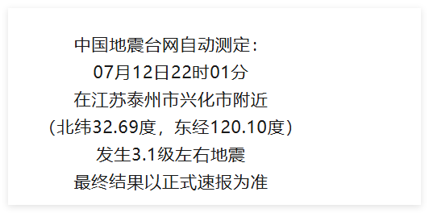
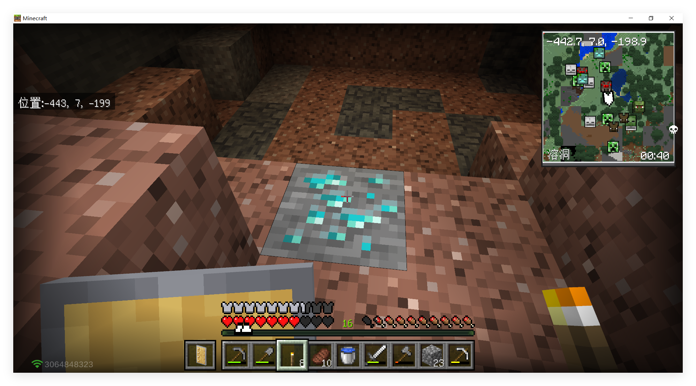
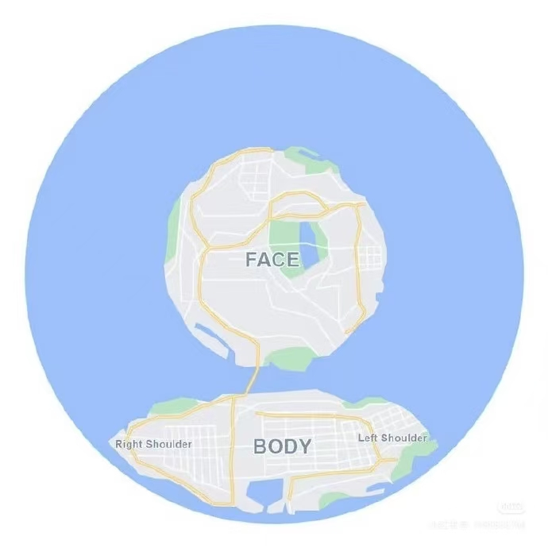

# 标签语法
标签成对出现，中间包裹内容  
`<>`里放标签名  
结束标签比开始标签多`/`
>双标签`<strong>文字加粗</strong>`、单标签`<br>` `hr`  
# HTML基本骨架
基本骨架--网页模板  
快速生成 `!`+`Enter`
```html
<!DOCTYPE html>
<html lang="en">
<head>
    <meta charset="UTF-8">
    <meta name="viewport" content="width=device-width, initial-scale=1.0">
    <title>网页标题</title>
</head>
<body>
    网页主体
</body>
</html>
```
# 标签的关系
作用：明确代码的书写位置
- 父子关系（嵌套关系）`<html>`与`<head>`
- 兄弟关系（并列关系）`<head>`与`<body>`
*注意缩进与对齐*
# 注释
`<!--  -->`:注释代码、解释说明
$vscode$快捷键`Ctrl`+`/`
# 标题标签
标签名:`h1`~`h6`$(双标签)$  
显示特点:
- 文字加粗
- 字号逐渐减小
- 独占一行(自动换行)
**使用vscode进行书写时，直接敲`h1`即有快捷键**(其他标签也是如此)
一般一个网页，h1只用一次
# 段落标签
标签名:`<p></p>`双标签
显示效果：独占一行、段落间有间隙
# 换行与水平线标签(单标签)
## 换行
标签名:`<br>`,浏览器不识别代码中的`Enter`换行  
*可写在两行之间*

## 水平线
标签名:`<hr>`
# 文本格式化标签
作用：为文本添加特殊格式，以**突出重点**。常见的文本格式：<strong>加粗</strong>、<i>倾斜</i>、<u>下划线</u>、<del>删除线</del>

加粗：`<strong></strong>` `<b></b>`
倾斜：`<em></em>` `<i></i>`
下划线：`<ins></ins>` `<u></u>`
删除线：`<del></del>` `<s></s>`
推荐使用左侧标签
# 图像标签
作用：在网页中插入图片
属性与属性间仅由空格隔开即可，属性应当写在尖括号内部
``
src用于指定*图像的位置和名称*（即图片的URL），是``的必须属性
``
## 图像标签的属性
`alt`:替换文本，图片无法显示时显示的文字(在图片未加载出来时不影响网页内容)
`title`:提示文本，鼠标悬停在图片上时显示的文字
`width`:图片的宽度，值为数字，没有单位
`height`:图片的高度，值为数字，没有单位
``
``等比例缩放
# 路径
指查找文件时，从起点到终点经历的路线
- 相对路径：从当前文件位置出发查找目标文件
  - `/`表示进入某个文件夹里
  - `.`表示当前文件所在文件夹
  - `./`当前文件夹，进入当前文件夹，用于表示同级
  - `../`退回上一级文件夹，再进入该文件夹，用来表示与上级同级。写几个 ../ 就退几层（比如 ../../ 表示退回两级）
  - ```html
    <!-- 1.jpg -->
     
    <!-- 2.jpg -->
     
    <!-- 3.png -->
     ```
  
- 绝对路径：(Win)从盘符出发查找目标文件;Mac从根目录出发查找目标文件
  - Win默认是`\`,其它系统是`/`，建议统一写为`/`
  - 
  ```html
    
    
    //在线网址
     <!-- 网络地址 -->
    ```
  - 绝对路径的应用场景：**友情链接**(友链)
# 超链接
作用：点击跳转到其他页面
`<a href=""></a>`(双标签)
- 在线页面`<a href="https://www.luogu.com.cn/training/list?type=srqc-jc">洛谷题单广场</a>`
- 本地文件(相对路径)`<a href="./me.html">跳转到me</a>`

*但是并非在新页面打开*
实现方法：`<a href="./me.html" target="_blank">跳转到me</a>`
>开发初期，不知道超链接的跳转地址，href属性值写'#',表示空链接，不会跳转 
# 音频标签
`<audio src="音频的URL">(音频无法正常显示时显示这段文字)</audio>`
`<audio src="./夏季八弹(20260701晚).m4a">童话镇20260701晚</audio>`
`<audio src="./夏季八弹(20260701晚).m4a" controls>童话镇20260701晚</audio>`
`<audio src="./夏季八弹(20260701晚).m4a" controls loop>童话镇20260701晚</audio>`
## 常见属性：
- src(必须属性):音频URL，支持格式：MP3、Ogg、Wav
- controls:显示音频控制面板
- loop:循环播放
- autoplay:自动播放（为了提升用户体验，浏览器一般会禁用自动播放功能）
在H5中，如果属性名与属性值完全一样，可以简写为一个单词`controls='controls'`-->`controls`
# 视频标签
`<video src="视频的URL"></video>`
`<video src="./纸硬币.mp4" controls></video>`
`<video src="./纸硬币.mp4" controls muted autoplay></video>`

## 常见属性
- src:视频URL，支持格式：MP4、WebM、Ogg
- controls:显示视频控制面板
- loop:循环播放
- muted:静音播放
- autoplay:自动播放（为了提升用户体验，浏览器支持在静音状态下自动播放）
# 综合案例：个人简介
网页制作思路：从上到下，先整体再局部，逐步分析制作
分析内容->写代码->保存->刷新浏览器，看效果
# 列表
作用：布局内容排列整齐的区域
列表分类：无序列表、有序列表、定义列表。
## 无序列表
作用：布局排列整齐的不需要规定顺序的区域
标签:`ul`嵌套`li`,`ul`式无序列表,`li`是列表条目
```html
<ul>
  <li>第一项</li>
  <li>第二项</li>
  <li>第三项</li>
  ...
</ul>
```
**`ul`标签里只能包裹`li`标签(不能包含如`<h1>`)，`li`标签里可以包裹任何内容**
## 有序列表
作用：布局排列整齐的需要规定顺序的区域
标签:`ol`嵌套`li`,`ol`是有序列表，`li`是列表条目
```html
<ol>
  <li>第一项</li>
  <li>第二项</li>
  <li>第三项</li>
  ...
</ol>
```
**`ol`标签里只能包裹`li`标签(不能包含如`<h1>`)，`li`标签里可以包裹任何内容**
## 定义列表
标签:`dl`嵌套`dt`和`dd`，`dl`是定义列表，`dt`是定义列表的标题，`dd`是定义列表的描述/详情.
```html
<ul>
    <li>咕咕</li>
    <li>嘎嘎</li>
    <li>咕咕嘎嘎</li>
</ul>
<ol>
    <li>咕咕</li>
    <li>嘎嘎</li>
    <li>咕咕嘎嘎</li>
</ol>
<dl>
    <dt>姓名</dt>
    <dd>凉州词</dd>
    <dd>顾咕嘎</dd>
    <dt>性别</dt>
    <dd>男</dd>
    <dt>民族</dt>
    <dd>汉</dd>
</dl>
```
**`dl`标签里只能包裹`dt` `dd`标签(不能包含如`<h1>`)，`dt` `dd`标签里可以包裹任何内容**
# 表格
作用：展示数据
标签:`table`(表格)嵌套`tr`(行),`tr`嵌套`th(表头单元格)/td(内容单元格)`
**在网页中，表格默认没有边框线，使用`border`属性可以为表格添加边框线**
```html
<table border="1"><!-- '1'像素粗-->
    <tr>
        <th>姓名</th>
        <th>语文</th>
        <th>数学</th>
        <th>总分</th>
    </tr>
    <tr>
        <td>张飒</td>
        <td>99</td>
        <td>100</td>
        <td>199</td>
        <!-- <td>heihei</td> 会额外增加一列--> 
    </tr>
</table>
```
# 表格结构标签
作用：用表格结构标签吧内容划分区域，让表格结构更清晰，语义更清晰
`thead`:表格头部（表格头部内容）
`tbody`:表格主题（主要内容区域）
`tfoot`:表格底部（汇总信息区域）
**仅是浏览器自己看代码看得更清晰，视觉效果上并无改变，故了解即可**
```html
<table border="3">
<thead>
    <tr>
        <th>姓名</th>
        <th>语文</th>
        <th>数学</th>
        <th>总分</th>
    </tr>
</thead>
<tbody>
    <tr>
        <td>张飒</td>
        <td>99</td>
        <td>100</td>
        <td>199</td>
    </tr>
    <tr>
        <td>丽斯</td>
        <td>98</td>
        <td>94</td>
        <td>192</td>
    </tr>
</tbody>
<tfoot>
    <tr>
        <td>总结</td>
        <td>全市第一</td>
        <td>全市第一</td>
        <td>全市第一</td>
    </tr>
</tfoot>
</table>
```
# 合并单元格
作用：将多个单元格合并成一个单元格，以合并同类信息（跨行、跨列）
合并单元格的步骤；
- 明确合并的目标
- 保留最左最上的单元格，添加属性（取值是数字，表示需要合并的单元格数量）
  - 跨行合并，保留最上单元格，添加属性`rowspan`
```html
<tbody>
    <tr>
        <td>张飒</td>
        <td>99</td>
        <td rowspan="2">100</td>
        <td>199</td>
    </tr>
    <tr>
        <td>丽斯</td>
        <td>98</td>
        <!-- <td>100</td> -->
        <td>198</td>
    </tr>
</tbody>
```
  - 跨列合并，保留最左单元格，添加属性`colspan`
```html
<tfoot>
    <tr>
        <td>总结</td>
        <td colspan="3">全市第一</td>
        <!-- <td>全市第一</td>
        <td>全市第一</td> -->
    </tr>
</tfoot>
```
- 删除其他单元格

**`rowspan` `colspan` 等号后写要合并的块数（记得合并时要在结构里，不可跨结构【即`tbody`不可与`tfoot`合并】，并且是“最左最右”）**
# 表单
作用：收集用户信息
使用场景：
- 登录页面
- 注册页面
- 搜索区域
## `input`标签基本使用
`<input type="...">`:`type`属性值不同，则功能不同
### `type`属性值
- text:文本框，用于输入单行文本
- password:密码框
- radio:单选框
- checkbox:多选框
- file:上传文件
```html
文本框：<input type="text">
        <br><br>
密码框：<input type="password">
        <br><br>
单选框：<input type="radio">
        <br><br>
多选框：<input type="checkbox">
        <br><br>
文件上传：<input type="file">
```
### `input`标签占位文本
占位文本：提示信息
`<input type="..." placeholder="提示信息">`
```html
文本框: <input type="text" placeholder="请输入用户名">
        <br><br>
密码框: <input type="password" placeholder="请输入密码">
...
```
### `radio`
常用属性：
- name:控件名称（控件分组，同组只能选中一个，单选）
- checked:默认选中（属性名与属性值相同，简写为一个单词）
```html
我是：
<input type="radio" name="gender">GG
<input type="radio" name="gender" checked>MM
```
### `file`
默认情况下，文件上传表单控件只能上传一个文件，添加`multiple`属性可以实现**文件多选**功能
```html
<input type="file" multiple>
```
### `checkbox`
多选框也叫复选框
默认选中:`checked`
```html
兴趣爱好:
<input type="checkbox">数学
<input type="checkbox">英语
<input type="checkbox" checked>编程
<input type="checkbox">锻炼
```
# 下拉菜单
标签:`select`嵌套`option`,`select`是下拉菜单整体，`option`是下拉菜单的每一项
默认显示第一个option或者使用`selected`
```html
城市:
<select name="" id=""> <!--这两个属性是发送数据用的，目前暂时用不到-->
    <option value="">北京</option> <!-- value也是 -->
    <option value="">上海</option>
    <option value="" selected>南京</option>
    <option value="">苏州</option>
</select>
```
# 文本域
作用：**多行**输入文本的表单控件
标签：`textarea`，双标签
`<textarea name="" id="">默认提示文字</textarea>`
```html
<textarea name="" id="">请输入评论</textarea>
<!-- 右下角有拖拽功能，实际应用中会禁用 -->
<!-- 并且虽然有row、col属性，但一般都用CSS设置尺寸 -->
```
# `label`标签
作用网页中，某个标签的说明文本
经验：用`label`标签绑定文字和表单控件的关系，增大表单控件的点击范围
## 增大点击范围
### 写法一
- `label`标签只包裹内容，不包裹表单控件
- 设置`label`标签的`for`属性值，和表单控件的`id`值相同
```html
我是：
<input type="radio" name="gender" id="man"><label for="man">男</label>
<input type="radio" name="gender" checked id="woman"><label for="woman">女</label>
<!-- 以前要点圆圈才可选中，现在可以直接点文字 -->
```
### 写法二(简单粗暴)
- 使用`label`标签包裹文字和表单控件，不需要属性
```html
我是：
<label ><input type="radio" name="gender">GG</label>
<label ><input type="radio" name="gender" checked>MM</label>
```
**实际上注意不同组单选不可用同一`name`比如， `name`不能都写`gender`，不然会默认同一组，进而影响单选性质与默认选项**

**提示：支持`label`标签增大点击范围的表单控件：文本框、密码框、上传文件、单选框、多选框、下拉菜单、文本域等等**
# 按钮-`button`
`<button type="">提示文字</button>`
`type`属性值：
- `submit`:提交按钮，点击后可以提交数据到后台（默认功能）
- `reset`:重置按钮，点击后将表单控件恢复默认值
- `button`:普通按钮，默认没有功能，一般配合`JavaScript`使用

重置区域应当用`form`括住表单区域
```html
<form action="">
    文本框: <input type="text" placeholder="请输入用户名">
    <br><br>
    密码框: <input type="password" placeholder="请输入密码">
    <!-- 省略type 则默认submit -->
    <button type="submit">提交</button>
    <button type="reset">重置</button>
    <button type="button">按钮</button>
</form>
```
# 无语义的布局标签
作用：布局网页（划分网页区域，摆放内容）
- `div`:独占一行（大盒子）
```html
<div>这是div标签</div>
<div>这是div标签</div>
```
- `span`:不换行（小盒子）
```html
<span>这是span标签</span>
<span>这是span标签</span>
```
# 字符实体
作用：在网页中显示预留字符
常用:空格`&nbsp;`、小于号`&lt;`、大于号`&gt;`
*在代码中用键盘敲多个空格，网页只识别一个*
`&lt;p&gt;`
# 综合案例一-新闻列表
```html
<ul>
    <li>
        
        <h2>凉州词挖矿挖到钻石</h2>
    </li>
    <li>
        
        <h2>凉州词晚上吃蓝莓冰淇淋</h2>
    </li>
    <li>
        
        <h2>栀子花没给凉州词提供图片，凉州词自己随便找了一个</h2>
    </li>
    <li>
        
        <h2>栀子花补救了小猫</h2>
    </li>
</ul>
```
# 综合案例二-注册信息
```html
<h1>注册信息</h1>
<form action="">
    <h2>个人信息</h2>
    <label >姓名: <input type="text" placeholder="请输入真实姓名"></label>    
    <br><br>
    <label >密码: <input type="password" placeholder="请输入密码"></label>    
    <br><br>
    <label >确认密码: <input type="password" placeholder="请再次输入密码"></label>    
    <br><br>
    性别:
    <!-- for需要跟id对应，没有对应的话需要删掉 -->
    <label ><input type="radio" name="gender4" checked>男</label>    
    <label ><input type="radio" name="gender4" >女</label>        
    <br><br>
    城市:
    <select name="" id="">
        <option value="">北京</option>
        <option value="">苏州</option>
        <option value="" selected>南京</option>
        <option value="">上海</option>
        <option value="">无锡</option>
        <option value="">泰州</option>
    </select>
    <br>
    <h2>教育经历</h2>
    最高学历:
    <select name="" id="">
        <option value="">小学</option>
        <option value="">初中</option>
        <option value="">高中</option>
        <option value="">专科</option>
        <option value="">本科</option>
        <option value="">硕士</option>
        <option value="">博士</option>
    </select>
    <br><br>
    学校名称:
    <input type="text">
    <br><br>
    所学专业:
    <input type="text">
    <br><br>
    <label >在校时间:</label>
    <br>
    <select name="" id="">
        <option value="">2025</option>
        <option value="">2024</option>
        <option value="">2023</option>
        <option value="">2022</option>
        <option value="">2021</option>
        <option value="">2020</option>
        <option value="">2019</option>
    </select>
    ---
    <select name="" id="">
        <option value="">2029</option>
        <option value="">2028</option>
        <option value="">2027</option>
        <option value="">2026</option>
        <option value="">2025</option>
        <option value="">2024</option>
        <option value="">2023</option>
    </select>
    <br><br>
    自我介绍:
    <textarea name="" id=""></textarea>
    <br><br>
    <input type="checkbox">已阅读并同意以下协议:
    <ul>
        <li>
            <a href="#">《用户服务协议》</a>
        </li>
        <li>
            <a href="#">《隐私政策》</a>
        </li>
    </ul>
    <br>
    <button type="submit">注册</button>
    <button type="reset">重新填写</button>
    
</form>
```